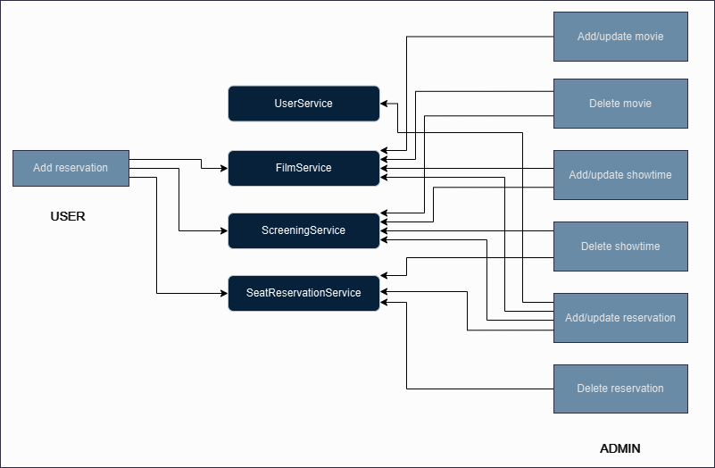
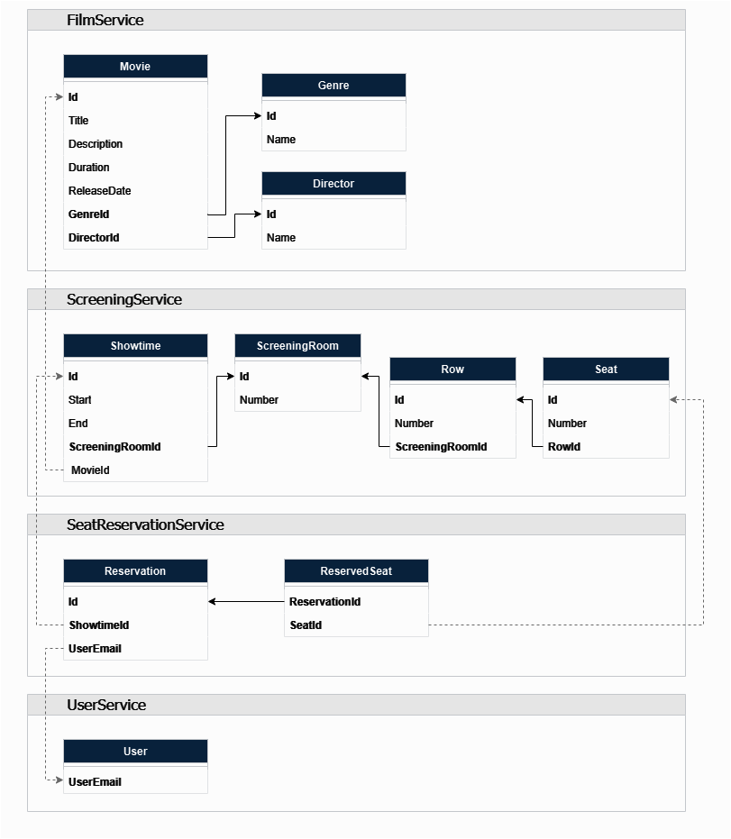

# CinemaBooking

### Description

**CinemaBooking** is an application for movie tickets reservation split into multiple microservices with each keeping its own database. Communication between microservices is, for now, done only synchronously through their REST API endpoints. User access is role-based with "user" and "admin" roles. Ocelot API Gateway provides a single entry point for clients, featuring caching and authentication. Distributed caching with Redis is implemented in service-to-service communication. Blazor is used to create a simple front-end.

### Technologies

- ASP.NET Core
- Entity Framework Core
- SQL Server
- Ocelot
- Redis
- Blazor
- Tailwind

### Features in progress

- Reservation functionalities in Blazor

### Users

Login credentials:

- _USERNAME_: novana _PASSWORD_: Novana-0
- _USERNAME_: admin _PASSWORD_: Administrator-0

### Diagram

Basic idea of client's interaction with microservices:

### Databases

